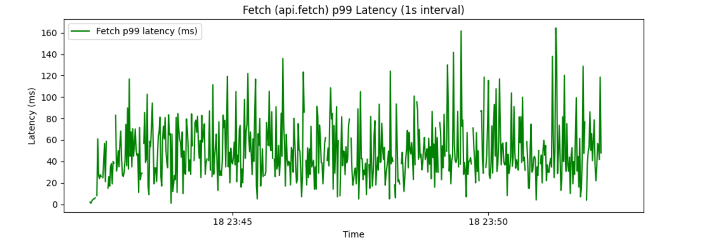

# Local Kafka Service

This repository contains a simple HTTP server that acts as a lightweight, persistent event log, inspired the Apache Kafka protocol.


It is **not** a full Kafka reimplmentation, but rather a fun exercise in exploring event streaming, partitioned logs, and file-based persistence. The focus is on efficiently ingesting, storing, and querying records for a single "topic" with 100 partitions. There are no control plane APIs for creating, deleting, or re-partitioning topics.


## Features
* Produce records with a key and value to any partition (0-100)
* Fetch all records in a partition
* Persistent: Records survive server restarts with guaranteed offsets and ordering
* Optimized Fetch: Fetch operations are designed to minimize data processing
* Low File Count: All data is stored using fewer than 5 files


## API

The server supports two main operations: producing and fetching records.

### Producing Events

To produce a record to partition 5 with key `user43` and value `goodbye`:

```sh
curl -X POST http://localhost:8123/produce/5 \
  -H "Content-Type: application/x-www-form-urlencoded" \
  -d "key=user43&value=goodbye"
```

### Fetching Events

To fetch **all** records for partition 5:

```sh
curl -X GET http://localhost:8123/fetch/5
```


## Ingesting Records

### Diagram


The diagram above illustrates the end-to-end flow for ingesting (producing) a record into the service:

1. Client Request:
The client sends a request to produce a record with a given key and value to a specific partition.

2. API Handling:
The API (App Controller) receives the request and determines the correct RecordLogWriter responsible for the partition.

3. Batching & Buffering:
The RecordLogWriter buffers the record for a short batching window (250ms) to optimize disk I/O.

4. Flush & Append:
After the batching window, the writer groups buffered records by partition, creates a [PartitionSegment](#partition-segment) for each one and then appends them to appropriate log file

5. Commit & Metadata:
The writer commits the new offsets and file positions to the ControlPlaneService, which persists this commit metadata for durability and fast recovery.

6. Response to Client:
Once the record has been flushed and committed, the offset is returned to the client, confirming successful ingestion and persistence.


**Additional Notes:**

- **Partition to Log File Mapping:** In this implementation, we use the modulo operation (partitionId % number_of_log_files) to determine which RecordLogWriter (and corresponding log file) will handle the record. This allows us to support many partitions with only a few underlying files.

- **Atomic Offset Assignment with Locks:**
Although Node.js is single-threaded, multiple concurrent produce requests for the same partition can still occur. Each RecordLogWriter maintains a separate lock per partition, ensuring that offset assignment and updates are performed atomically and consistently before records are batched.


### Partition Segment
A PartitionSegment is laid out as follows:

```mathematica
+-------------------+-----------------------------+
|  Header (20 bytes)|    Payload (variable size)  |
+-------------------+-----------------------------+
```

**Header (20 bytes):**

* Magic Number (4 bytes): 0xabcd1234 — Identifies the start of a segment.

* Partition ID (4 bytes): The partition this segment belongs to.

* Starting Offset (8 bytes): Offset of the first record in this segment (8 bytes = 64 bits, supports extremely large offsets).

* Payload Size (4 bytes): Number of bytes in the following payload.


**Payload:** A concatenated list of payload items, one for each record in the batch.
Each payload item encodes:

* Key Length (4 bytes)

* Key (UTF-8, up to 1024 bytes)

* Value Length (4 bytes)

* Value (UTF-8, up to 1024 bytes)

```mathematica
+------------+-----------+-------------+-------------+
| Key Length |   Key     | Value Length|   Value     |
|   (4B)     | (≤1024B)  |   (4B)      |   (≤1024B)  |
+------------+-----------+-------------+-------------+
```

#### How This Design Works in Practice
* Scanning/Seeking: When reading a log file, the header lets us quickly determine whether the following payload is relevant to a given partition and offset. Irrelevant segments are skipped in O(1).

* Recovery: The magic number helps delimit valid segments and start reading at arbitrary offsets in the file.

* Offset Range: Offsets are stored as 8-byte big integers. This allows for offsets up to 2^64, which is quintillions of messages per partition—sufficient for decades of operation even at high ingest rates.

#### Offset Size Justification

8 bytes (64 bits): Maximum offset is 2^64 ≈ 1.84e19.
At 50,000 messages/second, this supports:

* Per day: ~4.32 billion messages

* Per year: ~1.57 trillion messages

* For 100 years: ~1.57e14 messages (still far less than max!)

* At max, could run for ~11.6 million years at this throughput.

6 bytes (48 bits): Maximum offset is 2^48 ≈ 2.81e14.

* At 50,000 messages/sec: would last for ~178 years.

While 6 bytes is definitely enough for this exercise (& maybe even a production version), I decided to go with 8 bytes as overkill and to "future proof" the system.


## Fetching Records


The diagram above illustrates the flow for fetching all records in a partition:

1. Client Request:
   The client sends a fetch request for a given partitionId to the API.

2. Offset Lookup via Cache:
   The API queries the in-memory RecordCache for the latest offset in that partition.
   * By keeping track of the latest offset in memory, the system knows where previous fetches left off and only needs to fetch new records (the "tail" of the file).

3. File Position via Control Plane:
   The API requests from the ControlPlaneService the exact byte position in the log file that corresponds to the latest offset for the partition.
   * Why this matters:
     This enables fetches to start reading from the most recent, relevant point—not from the beginning of the file—drastically reducing I/O for long-lived partitions.

4. Log File Scan via RecordLogReader:
   The API instructs the appropriate RecordLogReader to scan the log file from the determined file position.
   The reader sequentially processes each PartitionSegment from that position onward.

5. PartitionSegment Header Scanning:
   For each segment encountered:
   * The reader inspects the header to determine if the segment's partitionId matches the target partition.
   
   If it matches:
   * The payload is read, parsed, and the contained records are extracted.
   
   If it does not match:
   * The segment's payload is quickly skipped, thanks to the payload size in the header.

6. Return Results and Cache Update:
   The reader returns all found records to the API, which updates the cache for the partition, ensuring the latest offset is always tracked.

7. Client Response:
   The API returns the full list of records (as a JSON array) to the client.


## Benchmark

To test the service, I used [autocannon](https://github.com/mcollina/autocannon) and wrote a small script that sends 100 records per second per partition. Each partition is also fetched every 30 seconds (with jitter) to mimic real-time consumption. The results are summarized below.

---

### Fetch Count: Raw Records Returned


**Description:**  
This chart shows the cumulative number of records returned by the API over time. The steady, linear increase demonstrates that fetch operations are consistently returning new records as they are produced.


### Produce (api.produce) p99 Latency (1s interval)


**Description:**  
This graph displays the 99th percentile (p99) latency for produce requests, measured in 1-second intervals. The latency hovers around 250ms, with occasional spikes.

- The baseline latency closely matches the batching window (250ms), which is expected since records are flushed to disk in batches every 250ms.
- Occasional spikes may be due to disk I/O variability or Node.js event loop delays, but the system quickly recovers.

---

### Write Buffers: Buffer Size (mean) and Record Count (sum)


**Description:**  
This dual-axis plot shows the average buffer size (in bytes) and the total number of records per batch, aggregated over 1-second intervals. The average batch contains about 1000 records and is roughly 4KB in size.

---

### p99 Fetch Latency



**Description:**  
This chart shows the 99th percentile latency for fetch requests, measured every second. Latency typically ranges from 20ms to 80ms, with some higher outliers.

- The variability is due to the benchmark script introducing jitter, causing fetches to occur at random offsets and times.
- In a real-world scenario with sequential consumption, fetch latency would likely be even lower and more stable.

---

### RecordLogReader Query Latency


**Description:**  
This graph measures the average time it takes a RecordLogReader to find and return all records for a given partition, starting from a specific file position.

- The latency remains low and relatively stable, demonstrating the efficiency of the segment header scanning and file position tracking.

---

### RecordLogReader Record Count


**Description:**  
This plot shows the number of records returned by each RecordLogReader query, per second.

- The variability reflects the batching and fetch patterns, as well as the randomization in the benchmark script.
- High peaks indicate moments when large batches are read in a single operation, which is efficient for throughput.


## Development

To run the server, ensure you have Node.js 18 or higher. It’s recommended to use a Node version manager (like `nvm`) to select the correct version.

### Configure Node.js

```sh
nvm use 18.18
```

### Install Dependencies

```sh
pnpm install
```

### Running the App

```sh
# Development mode
pnpm run start

# Watch mode (auto-restart on changes)
pnpm run start:dev

# Production mode
pnpm run start:prod
```

### Running Unit Tests

```sh
pnpm run test
```

### Running the Benchmark

First, build the project:

```sh
pnpm run build
```

Then, run the benchmark script:

```sh
node dist/benchmark/run.js
```
